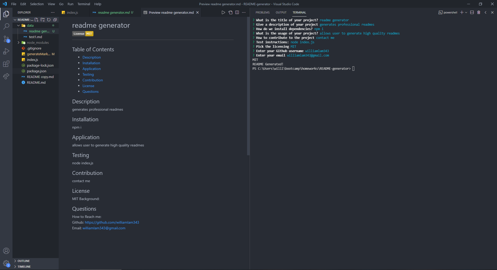

# README-generator

https://www.youtube.com/watch?v=wW13GA4Abto&ab_channel=Karel
 
A README generator I made using node.js and inqurier
It prompts users with several questions then generates a readme with the response

